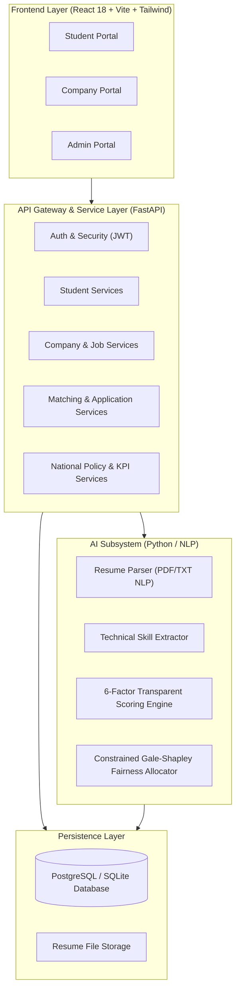

# System Architecture

## Overview

The **AI-Powered Internship Allocation Engine** is built using a decoupled Client-Server architecture designed to scale seamlessly while delivering real-time multi-constraint matching and high transparency.

## Directory Responsibilities

- **`frontend/`**: Interactive Single Page Application (SPA) with dedicated interfaces for Students, Companies, and Government Administrators.
- **`backend/`**: FastAPI REST server providing authentication, schema validation (Pydantic), and database transactions (SQLAlchemy).
- **`ai_engine/`**: Standalone NLP, embedding vectors, 0–100 scoring model, and Gale-Shapley matching algorithms.
- **`database/`**: DDL schemas, ER diagrams, indexing strategies, and database seeding routines.
- **`tests/`**: Integration and unit test suites covering the entire platform.
- **`docs/`**: Technical and policy documentation.
